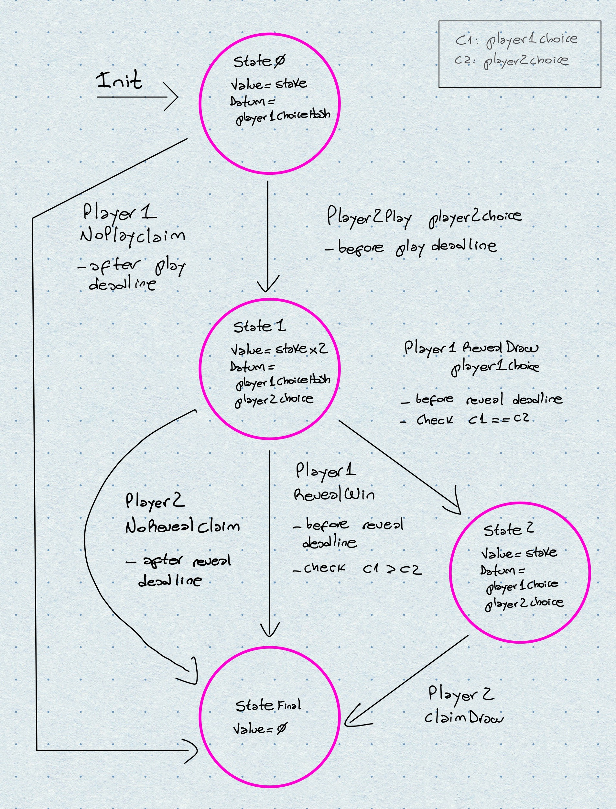

I've taken part of the second cohort of the [Plutus Pioneer Program](https://testnets.cardano.org/en/plutus-pioneer-program/) where one can
learn how to write Smart Contracts in [Cardano](https://cardano.org/) by using [Plutus](https://github.com/input-output-hk/plutus), set for main chain release in late 2021.

Cardano's version of Smart Contract is pretty "weird" coming from [Ethereum](https://ethereum.org/en/),
and I plan to write about it later but it does provide some interesting abstractions that let
you express common patterns rather easily, in particular we are going to be covering
how you can model your DApp as a state machine and how can you express said model in Plutus
pretty easily.

Cardano's Smart Contracts are written in a Haskell library called Plutus, so put up your
functional programming hat and let's get our hands dirty.

Note: at the time of writing there still some wrinkles in Cardano's smart contract platform, so
if you are not part of the Plutus Pioneer Program you might have some difficulties running the code,
but hopefully it will be a nice showcase of how Cardano enables smart contracts.
Also, State Machines are just a higher level abstraction to write smart contracts in Cardano but
not at all the only way, so you are not limited to them.

## Quick intro to Plutus Concepts

Plutus smart contracts should be called **Smart Transactions** because that is all you can really do _on-chain_.

From the outside, users can only generate **Transactions** with inputs (UTxOs or unspent transaction outputs of previous
transactions) and generate outputs (also UTxOs) at different public key addresses depending on the use case.

These transactions are created _off-chain_ and sent along with a trivial payload
called the **Redeemer**.

A transaction is only applied to the blockchain after being _validated_ by **Validator script**
which is the main thing DApp developers write and run _on-chain_.

This validator script has a public key address made up of its hash and
funds (UTxOs) can only be spent if the transaction trying to spend them
passes the validation, which is the business logic running _on-chain_.

A UTxO contains coins or Native Tokens plus a trivial custom payload called the `Datum`,
which serves as a custom application state and is central to the ability to write DApps.

The main difference between user accounts and script accounts is that
user accounts need to sign spending transactions with their private key but
anyone can spend from a script address if the transaction is considered valid by the
validator script itself. Is a pretty interesting model.

All this is part of the EUTxO model or the Extended Unspect Transaction Output which is
the model pioneered by Bitcoin with some extensions to allow _smart contracts_.

Surprisingly this model allows pretty much all what you would expect from a smart contract platform, it is just modeled
differently and does comes with trade-offs. It is similar to what `functional programming` brings to the table in terms
of predictability, testability and simpler interfaces comparing it to imperative or object oriented programming,
so we could say that **Cardano is a platform for pure functional smart contracts**.

## Rock Paper Scissors

We are going write the Rock Paper Scissors game but in the blockchain, I eventually will
like to really deploy it and add a nice UI on top of it.

The model we are going to use makes the first player commit to a play but without telling exactly the
play by using a hash, then the second player plays, and finally the first player reveals and the "stake"
or "bet" is distributed. There are also play deadlines and reveal deadlines to make the contract safe.

Here is a complete state diagram of our game model.
The transitions are labeled with the `Redeemer` and its payload, constraints and checks.
Constraints are common transaction constraints that Plutus provides abstractions for and
checks are anything else developers might want to check to allow or not a given state transition.
In our case we only use `checks` in the chase of `Player1RevealWin` and `Player1RevealDraw`, where
we check that effectively it is a win or a draw for Player1.
The state are composed of `Datum` which holds trivial data plus the staked / bet value.



## On-chain state: `Datum`

As we said before, the `Datum` will be a trivial piece of data we are going to store `on-chain`.
In this particular case we are going to use it to store the current state of our state machine plus
the choices made by players.

`FinalState` will contain no `Datum` and no `value` (coins and Native Tokens)

```haskell

data GameDatum =
      -- at first we only store the hash of the player1's choice
      State0 ByteString
      -- then we store the hash of the player1's choice plus the player2's choice
    | State1 ByteString            GameChoice.GameChoice
      -- when resolving draws we store both choices unhashed
    | State2 GameChoice.GameChoice GameChoice.GameChoice
      -- the final state stores nothing
    | StateFinal
    deriving Prelude.Show
```

[GameDatum.hs](https://github.com/franleplant/plutus-pioneer-program-fork/blob/rock-paper-scissors/code/week07/src/RPS/GameDatum.hs)

## Transaction validator input: `Redeemer`

```haskell
data GameRedeemer =
        Player2Play       GameChoice.GameChoice
      | Player2NoRevealClaim
      | Player1RevealWin  ByteString GameChoice.GameChoice
      | Player1RevealDraw ByteString GameChoice.GameChoice
      | Player2ClaimDraw
      | Player1NoPlayClaim
    deriving Prelude.Show
```

These are the actions players can take to move the game state around.

[GameRedeemer.hs](https://github.com/franleplant/plutus-pioneer-program-fork/blob/rock-paper-scissors/code/week07/src/RPS/GameRedeemer.hs)

## On-chain validator: State Machine

This is the abstraction on top of a regular validator script that Plutus provides in order
to model the common case of a State Machine.

We are only going to show one of the main happy paths, player 1 plays,
then player 2 plays, finally player 1 reveals and win:

```haskell
-- this are arms of a haskell's case and we are doing pattern matching.
-- (State0, Player2Play) -> State1
-- this represents the valid transition from State0 where Player1
-- played in secret to State1 where Player2 played (not secretly)
(State0 player1ChoiceHash, GameRedeemer.Player2Play player2Choice, staked)
  -- each player needs to stake in order to play
  -- this validates that State0 has 1xStake
  | lovelaces staked == Game.stake game ->
      let constraints = Constraints.mustBeSignedBy (Game.player2 game) <>
                        Constraints.mustValidateIn (to $ Game.playDeadline game)
          datum       = State1 player1ChoiceHash player2Choice
          stake       = (lovelaceValueOf $ 2 * Game.stake game)
      -- we return the next state: State1 (plus its payload)
      in Just (constraints , State datum stake)


-- (State1, Player1RevealWin) -> StateFinal
(State1 _ _, GameRedeemer.Player1RevealWin _ _, staked)
  -- since both player played at this stage, the amount
  -- of coins staked should be 2x stake
  | lovelaces staked == (2 * Game.stake game) ->
      let constraints = Constraints.mustBeSignedBy (Game.player1 game) <>
                        Constraints.mustValidateIn (to $ Game.revealDeadline game) <>
                        Constraints.mustPayToPubKey (Game.player1 game) (lovelaceValueOf $ 2 * Game.stake game)
      -- we return the next state: StateFinal
      in Just (constraints, State StateFinal mempty)


```

[Validator.hs](https://github.com/franleplant/plutus-pioneer-program-fork/blob/rock-paper-scissors/code/week07/src/RPS/Validator.hs)

`constraints` are a Plutus primitive that lets you express checks for the incoming transaction,
have in mind that this validator runs whenever some trivial address is trying to consume one of its
UTxOs, so in order to spend a UTxO the validator needs to agree with said action.

In this case we are only allowing this particular state change to happen if the transaction
trying to be applied is signed by Player2 and it is done before the `playDeadline`.

We return the next State defined in `datum` and we duplicate the `stake` amount of Ada
because Player2 needs to `stake` or `bet` in order to participate.

Additional checks can be done by implementing a `check` function, here is an
example of how we use it to add an extra check to the `Player1RevealWin` transition.
We simply check that the revealed choice that Player1 made actually wins Player2's:

```haskell
check (State1 player1ChoiceHash player2Choice) (Player1RevealWin nonce player1Choice) _ =
    traceIfFalse "player1 should reveal the original choice"
      (player1ChoiceHash == presentedPlayer1ChoiceHash) &&
    traceIfFalse "player1 beats player2"
      (GameChoice.beats player1Choice player2Choice)
        where
            player1ChoiceString :: ByteString
            player1ChoiceString = case player1Choice of
                GameChoice.Rock     -> rock
                GameChoice.Paper    -> paper
                GameChoice.Scissors -> scissors

            presentedPlayer1ChoiceHash :: ByteString
            presentedPlayer1ChoiceHash =  choiceHash
                where
                    choiceHash = sha2_256 (nonce `concatenate` player1ChoiceString)

```

Note: I've omitted some details for clarity, check the [full code](https://github.com/franleplant/plutus-pioneer-program-fork/blob/rock-paper-scissors/code/week07/src/RPS/Validator.hs)

## Off-chain code

Plutus is heavy on the Off-chain code, but it is safe to do so because the important constraints should
always be implemented on the `validators`.

The off-chain code, also written in Haskell and that will be later allowed to be run in the browser simply
allows two users to play this game. The first player _instantiates_ the contract by playing secretly and
adding a stake.

Player2 plays by finding an open game and playing and staking.

When the deadlines are passed a winner is decided and the reward (staked) is claimed.

Nothing illegal should be allowed to happen because our on-chain code (validator) should only allow
certain valid transactions to happen and nothing else.

[off chain code](https://github.com/franleplant/plutus-pioneer-program-fork/blob/rock-paper-scissors/code/week07/src/RPS.hs)

## Outro

[Check the full code here](https://github.com/franleplant/plutus-pioneer-program-fork/tree/rock-paper-scissors/code/week07/src)

Cardano and Plutus are really fun and interesting and there is a lot of things coming their way
that make me super excited about.

I'm anxious about actually deploying this dummy game to the main net and add a nice UI on top of it.
