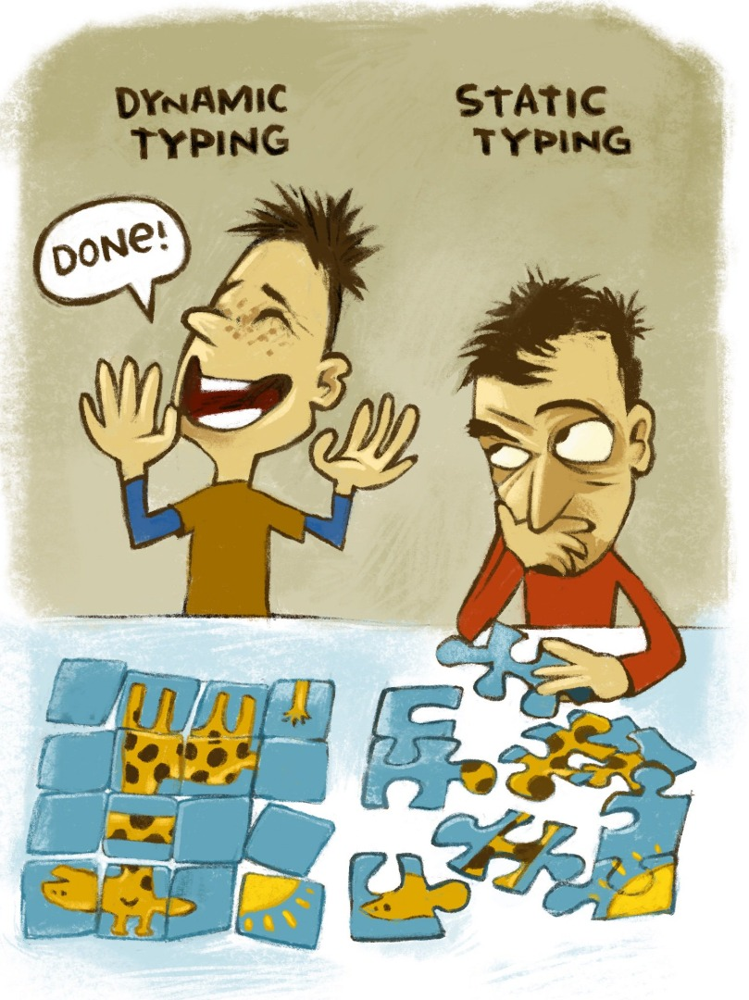

Do you dislike this statement? I do too, read on:

Isn’t it weird how a lot of developers maintain
these sort of inside jokes / memes of hating
certain tools and techniques like
programming languages or frameworks?

It is not the criticism that I find peculiar
but the emotional subjective response these folk
have toward inanimate things.
Let’s unpack this aspect of developer culture that we see everyday everywhere.

I have heard stuff like:

- Java is a verbose trash.
- Static Typing is extra boilerplate with no benefits.
- Javascript is trash.
- Javascript is crazy (talking about the nasty coercion rules it has).
- Php is the worst language ever.
- Only _newbies_ use PHP.
- PHP is not a real programming language.
- _Real programmers_ use Java because it has static typing.
- _Real programmers_ use _X_ (programming language, technique, etc).
- Dynamic typing is for newbies.
- Haskell is only for academic purposes.
- Node.js doesn’t have _concurrency_
- Node.js is slow because it doesn't have threads.
- Javascript’s _event-loop_ is bad.
- I don't need [Typescript][12] (static typing) because I already have [eslint][todo] (static analysis).
- and so much more.

I have heard these at work, at open source communities
and by speakers in conferences and although it is entirely
fine for people to resonate and feel more comfortable with
certain tools and techniques I believe that is better
to take a step back and try to think about these tools
more objectively, without so much emotion and with a cool head,
if we do that then we can understand the **trade offs** each tool
has and **why was it built like that** and, although we might never use
it, we will most likely understand why other people might,
when we might want to consider using it
and the reasoning behind the decisions
that lead to that result, which in programming are most
likely things we can extrapolate to other areas and
maintain a more rich and broad understanding of the vast programming landscape.

So for example, the other day I saw this meme used for a quick laugh at mostly Javascript.

And while I always enjoy a quick laugh, sometimes
these type of “jokes” hide a skew, subjective and
over simplified way of looking at things.

Does [dynamic typing][13] let you build programs (puzzles) **faster** that don't work or are **incorrect**?
Does [static typing][13] let you build programs (puzzles) **slower** that do work and are **correctly**?
Are Statically typed languages fundamentally better than Dynamically typed languages?

Of course no!

There is some nuance between the mechanisms by which different
programming languages allow developers to express logic and constraints,
and how and when they are verified and the errors are handled, one could
generalize Statically Typed languages as allowing more mechanisms to express
and verify constraints early on (mostly at build time) and
Dynamically Typed languages relying on later "out of band" constraint verifications
i.e. like doing more automated or manual testing and by doing that they allow
faster times to first run.

But that is a wide spectrum with a lot of nuance, not all statically typed languages
are the same, some of them provide [weaker][13] type systems and good escape hatches,
and some of them provide [strong][13] type systems that at least in my experience tend
to take more time to "agree with the compiler".

After a lot of time spent in Dynamically Typed languages
such as Javascript and [Python][14] now I really value
a good Statically typed language and most of the time
I do prefer them over untyped because of the capability
of Statically verifying correctness of my program at least partially,
because of the autocompletion among other things,
that is why now a days if I get to chose I only
write [Typescript][12] and [typed Python][15];
but are Dynamically typed languages the worst of the
two every time for every use case?
Are Dynamically typed languages so sloppy
that they let you build weird giraffes (not achieve the desired functionality)?

The answer is a definitive **no**.

There are some cases where Dynamically Typed languages
let you express certain highly dynamic patterns
with much less boilerplate and more ease.
Highly polymorphic logic might be a good example of this,
it is much straight forward to do that in Dynamically Typed languages
with simple [duck typing][16] that it is with Statically typed languages
by using [generics][17], [templates][18] or other mechanisms.

This [article][19] has some good illustrations of this.

TODO anothewr good example is metaprogramming

There is a **multi dimensional space**
that has axis such as **development speed**, **correctness verification**,
**memory safety**, **performance**, **ergonomics**, etc that
Programming Languages need to navigate.

In particular, programming languages will be better at some
of these dimensions and worse at others,
right now there isn’t a perfect language that maximises
all dimensions although there has been an explosion of programming
languages in the past 10 years with things such as
[Go][20], [Rust][21], [C#][22], [Typescript][12],
among others that take a lot of the lessons of the past and
overall they achieve more than previous languages,
only because of the iterative effect of technology.

Take Rust for example, which I really like and that has taught me a lot,
it is a language that tries to [maximise correctness, memory safety and performance][21]
and the Rust team understands perfectly that these
things hurt expressiveness and development speed and
although they actively try to improve the developer experience
they always maximise correctness, memory safety and performance first,
and never they hurt those core values because of developer experience,
and so Rust is widely known as a language
on the hard to learn side, verbose and that for certain highly
dynamic cases you will end up both struggling and resorting to a variety
of escape hatches.

But in a lot of ways Rust is better than its peers (C / C++ mostly),
it has better memory safety, a much more expressive
Type system, it provides higher level abstractions
that compile down to very efficient code,
it does have a [modern module system][23]
instead of the header file system that I do believe is outdated and verbose,
it replaces C/C++ build config files such as [Makefiles][24] (and others)
with a standard abstraction: [cargo][25],
it provides a single standard mechanism for
library publishing, distribution and consumption: `cargo` and [crates.io][26]
instead of the multiple non standard ways C/C++ deal with these sort of things.

But this is also not about bashing C/C++ which,
although they have drawbacks as every tool out there,
are super mature tools with mature ecosystems,
libraries, documentation, etc, that are hard to beat
in a lot of senses, in fact a lot of the major mission critical
software we use currently relies heavily on them like
[openssl][27], [Linux][28] which is the base for [android][29], to name a few.
C++ in particular has made a lot of strives towards
correctness, ergonomics and more and if you really need
the performance, C/C++ are conservative choices that will most likely work.

And what about PHP? Have you seen it recently? It is far from
a perfect language and I personally do not resonate with it but
it has come a long way from its very humble and chaotic beginnings.
Recently it has added [type hints][30], [partial static type checking][31],
it has added [traits][33], has [increased its performance][34],
and with modern frameworks such as [Laravel][32] developers can actually write
very decent programs with it. And let's not mention the amount of community
support, pervasive cheap hosting and more that it has.

## Problem space framework

Let me try to list some of the important aspects I consider when trying to evaluate
programming tools objectively. Again, you and your team will most likely
use your subjective biases to select them but I do believe it is nice to have at least
a semi structured, objective, way of evaluating tools like Programming languages

- ergonomics / dev speed / dev experience / expressiveness
- documentation / resources available / popularity
- maturity
- ecosystem / available libraries and their quality
- ecosystem / tooling such as IDEs
- is it actively maintained?
- how good is the community around it?
- long term status of the project
- performance
- type safety / correctness verification
- memory safety / memory management strategies (only for programming languages)
- fits my use case?

So for example, you might like Rust because of its
performance, memory safety and correctness but you want
to do [Machine Learning][35] then you most likely
will need to use Python because of its [blooming ecosystem][35],
and although you can statically check modern Python you will
most likely work with untyped codebases or examples
and if you give it a chance you will end up understanding where it’s coming from.

Another nice example is the infamous Javascript’s [event-loop][36].
I’ve heard so many people bashing it, complaining about
Js not having threads, complaining about this weird
thing that an event loop is, but with [async / await][37] and [promises][38]
you get a very ergonomic way of expressing [concurrent][39] “tasks”
without resorting to manual thread managing which
is a well known [hard][40] [thing][41] to do 100% correct.
In fact there are user level implementations of
event loops in [C][42] and [Rust][43] (and probably
in a lot more places) where although these
languages support threads they recognise that for
certain applications having
an event loop is a pretty good way of managing concurrent tasks.
Another modern way of managing concurrent task is Go’s [goroutines][44],
that have a higher level api that hides the manual managing of threads.

## Is Javascript the best programming language in the world?

I would say no, by a long shot, but does that mean
that it is 100% trash? Also no, by a long shot.

For example, in my opinion, closures and functions as a first class
citizens make up very expressive and powerful primitives to build
complex abstractions on top of, in fact
these things are inherited from the [lisp family][45] and are well understood tools,
from the [blooming origins][46] of Computer Science and programming languages.
We cannot also deny that, although
extremely chaotic, the NPM ecosystem is a boilerplate
of very good ideas that have shaped the way we develop
Javascript applications.

Does Javascript has bad parts? Lots!
In fact there’s a now mostly outdated but very
[popular book][47] about that.
But Javascript is starting to pick up the pace and
has made huge improvements in the past couple
of years with native module syntax which is very good
in my opinion (although native support is still far behind),
native class support that mostly works as you'd expect it,
user land hygienic macro system: [babel][48],
blooming statically typed variants such as Typescript and Flow
and so much more make Javascript a very solid choice
for a lot of projects.

Is it the best for all projects?
Most likely not, but understanding its trade off
will give you solid fundamentals to make up a better
educated choice of your tool.

## Why do we love or hate inanimate things?

I believe that in the bottom of this discussion lies
the emotions and feelings we get towards tools, it happens
in programming, it happens in woodworking, it happens generally
in arts and craftsmanship.

I think that the toxic hate you sometimes see in programming boils down
to 1) we tend to fall in love with certain tools because of all the amazing
things we can accomplish with them and this love also generates hate
towards obvious competitors (i.e. Dynamically vs Statically typed languages);
and 2) because of the meme quality of these tropes we as a developers maintain over time;
these rules of thumb that lead as to say things such as
_"Statically typing is bad because Java is verbose, you better use Node.js"_.
This is sometimes referred to as [Cargo Cult][10]

So we build these sort of _prejudice_ and ill informed conceptions of tools
that we might only understand superficially instead of objectively and holistically,
and this is something that seems to be part of the human nature since we build
_prejudice_ for people, animals, tools, places, etc. Humans are emotional beings
and we require a conscious effort to avoid having raw emotional subjective responses
to everything around us, but that's just the Engineer mind set that ends up being
more constructive and positive for our careers.

## Conclusion

Programming is such a new and exciting but very complex discipline that the variety of solutions
for a given problem might be very large and it is important that we as developers develop (pun intended)
an objective way of understanding these solutions, their trade offs and how to chose
among them; and perhaps how to combine them and add up their strengths.
In end there will be always tools we enjoy using more than others
but that doesn’t necessarily mean that those tools are objectively
universally better and the others are trash, it just that we like them,
they resonate with our minds or perhaps we simply
got more experience with them.

And perhaps some day we will find out the _perfect programming language_ but
we would still need to consider its ecosystem, support, community experience,
developers available and so many other things before adopting it to our projects.

In the end, this post is just me giving a message of **understanding,
empathy and compassion for our fellow developers**
that try to make a living in this very complex world of programming.

Like the content? Consider subscribing, buying me a coffee or even becoming a Patreon below.

[10]: https://en.wikipedia.org/wiki/Cargo_cult
[11]: https://eslint.org/
[12]: https://www.typescriptlang.org/
[13]: https://android.jlelse.eu/magic-lies-here-statically-typed-vs-dynamically-typed-languages-d151c7f95e2b
[14]: https://www.python.org/
[15]: https://www.python.org/dev/peps/pep-0484/
[16]: https://en.wikipedia.org/wiki/Duck_typing
[17]: https://en.wikipedia.org/wiki/Generic_programming
[18]: https://en.cppreference.com/w/cpp/language/templates
[19]: https://instil.co/blog/static-vs-dynamic-types/#generic-programming-and-simpler-errors
[20]: https://golang.org/
[21]: https://www.rust-lang.org/
[22]: https://docs.microsoft.com/en-us/dotnet/csharp/
[23]: https://doc.rust-lang.org/rust-by-example/mod.html
[24]: https://github.com/torvalds/linux/blob/master/Makefile
[25]: https://doc.rust-lang.org/cargo/
[26]: https://crates.io/
[27]: https://github.com/openssl/openssl
[28]: https://github.com/torvalds/linux
[29]: https://github.com/aosp-mirror/kernel_common
[30]: https://wiki.php.net/rfc/return_types
[31]: https://softwareengineering.stackexchange.com/questions/306749/is-php7-a-static-or-dynamic-typed-language/306755
[32]: https://laravel.com/
[33]: https://www.php.net/manual/en/language.oop5.traits.php
[34]: https://www.zend.com/blog/php-7
[35]: https://amzn.to/3onjpuR
[36]: https://developer.mozilla.org/en-US/docs/Web/JavaScript/EventLoop#event_loop
[37]: https://developer.mozilla.org/en-US/docs/Web/JavaScript/Reference/Statements/async_function
[38]: https://developer.mozilla.org/en-US/docs/Web/JavaScript/Reference/Global_Objects/Promise
[39]: https://en.wikipedia.org/wiki/Concurrency_(computer_science)
[40]: https://softwareengineering.stackexchange.com/questions/81003/how-to-explain-why-multi-threading-is-difficult
[41]: https://www.researchgate.net/publication/2956540_The_Problem_with_Threads
[42]: https://www.systutorials.com/docs/linux/man/3-ev/
[43]: https://github.com/tokio-rs/tokio
[44]: https://tour.golang.org/concurrency/1
[45]: https://docs.racket-lang.org/reference/let.html
[46]: https://amzn.to/38iYm6W
[47]: https://amzn.to/38lEMqF
[48]: https://babeljs.io/
