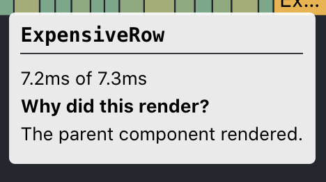

## TLDR: the gist

- Measure performance! If you don't measure it's the same as doing nothing.
- You can optimize your React performance by improving **what** (🤔) and **which** (🧙) components render.
- 🧙 To improve **which** component renders you can use
  - `React.memo`
  - `useCallback`
  - `useMemo`
  - Make sure your props have stable references
  - Virtualization
- 🤔 To improve **what** components render you should
  - identify the slow components
  - simplify, use more efficient abstractions, make smaller trees, etc

If this got your attention read on:

## Table of Contents

```toc
# This code block gets replaced with the TOC
to-heading: 5
```

## Introduction

In general computer programs can be:

- **io-bound**: spend most of their time making inputs and outputs
- **cpu-bound**: spend most of their time making calculations

And how do these translate into Front End apps and in particular React apps?

## io performance problems in React

- Browser apps can be **io-bounded** mostly in terms of asynchronous http calls.
- a poor management of these network requests can slow down your app

### Potential solutions

Although this will not be the focus of this post let's quickly cover some
important areas where solutions and improvements might be found for io-bound
problems:

- lazy load as much as you can.
- careful with the initial load of assets and also backend requests.
- reduce the amount of times you load highly static stuff (select options, configurations, etc)
- debounce the amount of times you make certain requests.
- parallelize request as much as possible via `Promise.all`.
- make your critical BE endpoints more efficient (i.e. by tweaking DB accesses and such).

## CPU performance problems in React

> This is going to be the main focus of this post.

Before talking about performance we need to define it in a more concrete way:

- browser apps are [single thread](https://stackoverflow.com/questions/30932870/why-doesnt-javascript-get-its-own-thread-in-common-browsers) programs for the most part.
- scripting, i.e. Javascript, DOM rendering, event handling, etc; all run in the same thread.
- if a Javascript module is slow it can block the main thread.
- if the main thread is blocked then the UI will seem unresponsive (**fps** will drop).
- unresponsive UIs are one of the worst offenders in terms of **User Experience**.

This all boils down to the concept of `fps` or **Frames Per Second**.
Responsive UIs will deliver a minimum of 30 fps or more ideally 60 fps, this means
that every frame of your app, even the more demanding code paths, should compute in **30 ms or less**.

> If your Javascript is slow it might cause "frames to be dropped" which means
> computing a frame in more than 30 ms.

To fully understand how this applies to React we need to understand how React works
and what React's **render and commit phase** are but in short we can say that:

> If a React component update is triggered then the **entire sub tree needs to be
> rendered in less than 30ms**.

This becomes specially problematic when you have complex and long component structures
such as Tables, Trees and Lists and in which sometimes (for example the first time) you will
need to re render large parts of them.

> **Summary:** we should figure out which expensive interactions are dropping frames,
> measure them to confirm and fix them.

## React render and commit phase

React works (at a high level) in two phases

**Render phase:**

- Happens when a component updates i.e. props or hooks changed.
- React traverses the component sub tree rendering each child and computing the virtual DOM (VDOM) sub tree.
- Only the "dirty" sub tree needs to be recomputed i.e. the updated component parents might not need to be re rendered.
- This phase is proportional to the size of the sub tree being rendered.
- This phase is also proportional to how expensive it is to compute each child component.
- We can give React hints to make this process more efficient i.e. `React.memo`.

**Commit phase:**

- The render phase outputs a new virtual DOM of the entire UI.
- In the commit phase Reacts compares the new tree with the previous one (VDOM diffing).
- React calculates the minimum DOM mutations needed to reflect the new VDOM tree.
- React mutates the DOM.
- Your UI is now updated.
- This phase is pretty efficient by default.

This whole process needs to happen in less than 30 or 16 ms (30 fps and 60 fps respectively) for your UI to be considered
responsive, as you can see there's a lot of work and that work is proportional to the size of your app.

We will explore ways to make mostly the **Render phase** more efficient but first let's discuss
how to measure and how to find out what are the slow parts of our app and how bad they are.

## Measuring

In 2020 we have pretty solid tools for measuring browser side performance, these
are the ones I use the most:

- Chrome dev tool's Performance tab.
- React dev tool's Performance tab.

### Chrome dev tool's Performance tab

This is the most comprehensive tool, it is useful for any browser application,
it measures frames per second, records stack traces, identifies slow / hot parts of your code,
and much more. The main UI is the [flame chart](http://www.brendangregg.com/flamegraphs.html).

Here's a [good doc](https://reactjs.org/docs/optimizing-performance.html#profiling-components-with-the-chrome-performance-tab)
of Chrome's Performance Tab applied to React.

### React dev tool's Performance tab

You need to install the [React dev tool extension](https://reactjs.org/blog/2019/08/15/new-react-devtools.html) in your browser.

It specializes the information in the Chrome dev tool's Performance tab to
React. You can see the different **commit phases** and the Javascript code that was run in its respective
**render phase** through a **flame chart**.

Through this tool you can easily find out:

- when a component re renders
- what props changed
- what hooks changed i.e. state, context, etc.

Check the [introductory post](https://reactjs.org/blog/2018/09/10/introducing-the-react-profiler.html) for more information.

### Measuring

This is the **methodology** I like to use when measuring front end applications:

- **identify the problem**: identify page interactions that make the UI feel unresponsive.
- **create a hypothesis**: optionally, we might have some ideas where the problem might be.
- **measure**: verify the problem by measuring and looking at important metrics such as **fps**.
- **measure**: identify problematic pieces of code, optionally: validate your hypothesis.
- **create a solution**: apply a solution based off the previous steps
- **measure the solution**: validate that the problem has been resolved or alleviated by looking at the important metrics.

> If you optimize something without measuring then you are practically doing nothing.

There might be cases where the problem is super obvious and I won't tell you that going straight
to fixing it is naturally bad, but most of the problems are not obvious and measuring will be
cornerstone of the performance improvement process.

Additionally, if you measure you can later tell your users, stakeholders and more importantly your **boss
that you have improved the performance of a given area of your app by x%** which is always a good
way of communicating upwards what we accomplish inside the rabbit hole.

## General solutions to cpu-bound problems in React applications

Now that we have measured and identified the problematic areas let's cover
potential solutions.

> You can optimize your React performance by
> improving **what** components render and
> **which** components render.

### 🤔 Improving _what_ components render

Identifying the slow parts of our React app will usually
point out to some particular components that are slow to render
(or that have too many instances in a single page, more on this in the **which** section).

There might be a number of reasons those components are slow, including:

- they do blocking calculations
- they render large trees
- they use expensive / non efficient libraries

Most of these boil down to improving how fast your components render,
sometimes critical components cannot rely on too complicated libraries
and so you need to go back to basic and roll your own simpler implementation.

I have experienced something like this when using [Formik](https://formik.org/) (which I love)
or should I say abusing Formik on several cells of every single row of a complex table.

You can go a long way making your components more efficient but eventually you will need
to focus on **which** components render:

### 🧙 Improving _which_ components render

There are two broad categories where we can improve this aspect:

- Virtualization
- Prop optimization

#### Virtualization

It means **only render what is visible in the viewport**, i.e. only render the
table rows that the user can see or the list items the user can see.

This is great because it can be applied to complex UIs without going through the **what** step,
although I recommend it; and modern libraries tend to have decent support for virtualizing
your tables and lists. A good example of this is [react-virtualized](https://github.com/bvaughn/react-virtualized).

> Virtualizing means that we **reduce the amount of components React needs to render in a given frame**.

#### Props Optimization

React tries to make your components look like pure functions but still will try to render
more times than it should.

##### `React.memo`

Most components in React can be **memoized**, which means that they do not have internal side effects
or depend on any external side effects so that we can guarantee than **with the same props the component
will return the same tree** (hooks, state and context are still respected though).

For that we can use [React.memo](https://reactjs.org/docs/react-api.html#reactmemo).
This tells React to skip re rendering these memoized components if their
props didn't change.

##### Fake prop changes: `useCallback`

Additionally we have the problem of **fake prop changes** which means that although
the content of a given prop didn't change, the reference did. The most classic example
of this is the event handler one:

```typescript
export function MyComponent() {
  const onChange = (e) => console.log(e);

  return <input onChange={onChange} />;
}
```

The `onChange` callback, although semantically and content wise will be the same on every render, will be
be stored in a completely separate memory direction so React will detect it as different from the previous one.

This is related to how `React.memo` does shallow comparison by default (although there's no good way of
deeply comparing functions in Javascript AFAIK).

An easy fix for this is to use `useCallback` which was designed exactly for this:

```typescript
export function MyComponent() {
  const onChange = useCallback((e) => console.log(e), []);

  return <input onChange={onChange} />;
}
```

##### Fake prop changes: `useMemo`

A similar problem can rise when building complex data structures and not memoizing them
correctly before passing them as props.

```typescript
export function MyComponent() {
  const rows = data
    .filter(bySearchCriteria)
    .sort(bySortOrder);

  return <Table data={rows} />;
}
```

This means that on every render we are re creating the `rows` array, and although
the content might not change, the shallow compare with the previous version will mark
it as different. To solve this React provides `useMemo`:

```typescript
export function MyComponent() {
  const rows = useMemo(
    () => data.filter(bySearchCriteria).sort(bySortOrder),
    [deps]
  );

  return <Table data={rows} />;
}
```

This will ensure rows are only recalculated when the dependencies change (most likely props or state).

You can also customize the way `React.memo` compares current vs previous props but be aware that this
calculation should be fast since it is effectively part of the **Render phase** and you probably
don't want to perform trivially nested deep comparisons on every render.

### Summary

The React profile is really good at telling you why a given component rendered out of
the three main options. Let's cover each option and potential paths of improvements

#### Props changed

How it looks in the React dev tool:


Did they really? Are they `fake prop changes`? Use `useCallback` and `useMemo`.

#### Parent rendered

How it looks in the React dev tool:



Use `React.memo` to memoize your _pure_ components.

#### Hooks changed (state, context)

How it looks in the React dev tool:


Nothing too obvious to do here. Try to validate that the hook that
changed makes sense. Perhaps a bad context provider is faking out
changes the same way as `fake prop changes` might appear.

## Closing

By now you should feel pretty confident in your skills to identify and improve
Performance problems in React. Of course _theory_ and _practice_ are different beasts
but your problem wont be far away from the ones we've covered, perhaps you will have to
deal with library updates, or components out of your control but that's life!

<hr/>

Like the content? Consider subscribing, buying me a coffee or even becoming a Patreon below.
